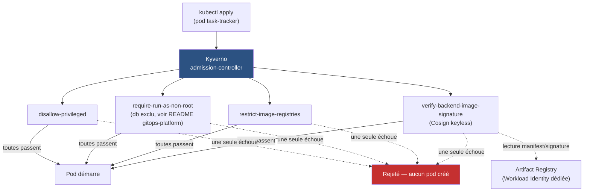

# DevSecOps & Supply Chain Security

Sécurise la chaîne d'approvisionnement logicielle de la plateforme des
Projets 1-3 : du code source jusqu'au déploiement Kubernetes. Construit
en suivant
[Projet-4-DevSecOps-Guide.md](Projet-4-DevSecOps-Guide.md).

## ⚠️ Ce dépôt ne contient PAS tout le Projet 4 — et c'est voulu

Contrairement aux Projets 2/3, les étapes 1 à 4 du guide (SAST, Trivy,
SBOM, Cosign) sont des étapes de **pipeline CI**, pas des ressources
Kubernetes — elles vivent dans `.github/workflows/` du dépôt
[gitops-platform](https://github.com/amadouldiallo/gitops-platform),
puisque c'est le pipeline CI de CETTE app qu'on sécurise. Un pipeline de
sécurité appartient au code qu'il protège, pas à un dépôt tiers.

Ce dépôt-ci contient les étapes 5 à 8 : ce qui s'applique au **cluster**
lui-même (Kyverno, Falco, NetworkPolicy durcies, tests de sécurité) —
déployées sur `gitops-platform`, le cluster GKE déjà provisionné (Projet
2), sans nouvelle infrastructure GCP.

| Étape | Où | Dépôt |
|---|---|---|
| 1 — SAST | `.github/workflows/` | gitops-platform |
| 2 — Trivy | `.github/workflows/` | gitops-platform |
| 3 — SBOM | `.github/workflows/` | gitops-platform |
| 4 — Cosign | `.github/workflows/` | gitops-platform |
| 5 — Kyverno | `k8s/kyverno/` | **ce dépôt** |
| 6 — Falco | `k8s/falco/` | **ce dépôt** |
| 7 — NetworkPolicy | `k8s/network-security/` | **ce dépôt** |
| 8 — Tests de sécurité | `docs/security-tests.md` | **ce dépôt** |

❓ **`terraform/` minimal ici, découvert en marche, pas planifié au départ** :
Kyverno, Falco et les NetworkPolicy sont des ressources Kubernetes pures —
mais Kyverno, lui, doit appeler directement l'API du registre pour
vérifier une signature Cosign, et n'hérite d'AUCUNE identité GCP par
défaut (contrairement à kubelet, qui tire les images via le SA du node).
Sans ça : `403 DENIED: artifactregistry.repositories.downloadArtifacts`
— vécu pour de vrai en testant l'Étape 5, voir
`terraform/modules/registry-access/`. La Workload Identity Federation de
la CI (pousser des images depuis GitHub Actions), elle, appartient
toujours au module `iam` **déjà existant** de gitops-platform, pas
dupliquée ici — seul le besoin RÉELLEMENT nouveau a sa place dans ce
dépôt.

## Comment lire ce dépôt

Mêmes symboles que les Projets 1-3 en tête de bloc de commentaire :

| Symbole | Signification |
|---|---|
| 🎯 | Le concept — ce que fait le composant, en langage simple |
| 🧠 | Analogie — pour ancrer le concept dans quelque chose de concret |
| ❓ | Pourquoi c'est important — la conséquence si on s'en passe |
| ⚠️ | Piège — une erreur facile à faire, rencontrée en écrivant ce code |
| 🔭 | Pour aller plus loin — une amélioration volontairement pas faite ici |

## Avancement

| Étape du guide | Statut |
|---|---|
| 1 — SAST | ✅ **testé sur le vrai pipeline** (dépôt gitops-platform) |
| 2 — Dependency Security (Trivy) | ✅ **3 vraies CVE trouvées et corrigées** (dépôt gitops-platform) |
| 3 — SBOM (Syft) | ✅ **SBOM réel généré (337 Ko), vérifié** (dépôt gitops-platform) |
| 4 — Image Signing (Cosign) | ✅ **signature vérifiée + contrôle négatif** (dépôt gitops-platform) |
| 5 — Admission Control (Kyverno) | ✅ **déployé, `Enforce`, testé sur le vrai cluster** — voir §Admission Control |
| 6 — Runtime Security (Falco) | ⬜ à faire |
| 7 — Network Security | ⬜ à faire |
| 8 — Security Testing | ⬜ à faire |

## Étapes 1-4 — CI de sécurité (dépôt gitops-platform)

Voir [gitops-platform/.github/workflows/security-ci.yml](https://github.com/amadouldiallo/gitops-platform/blob/main/.github/workflows/security-ci.yml)
et sa section [🔒 Évolutions liées au Projet 4](https://github.com/amadouldiallo/gitops-platform#-évolutions-liées-au-projet-4)
pour le détail complet. Résumé de ce qui a été RÉELLEMENT trouvé et
vérifié, pas juste "la CI est verte" :

- **SAST (Bandit)** : 0 issue sur le code du backend, vérifié localement
  puis en CI.
- **Trivy** a trouvé **3 vraies CVE HIGH** (`starlette==0.41.3`, avec
  correctif disponible pour chacune) — bloquées par le pipeline comme
  prévu, corrigées, re-vérifiées à 0 CVE restante.
- **SBOM** (Syft, SPDX) : 337 Ko générés par build, publiés comme
  artefact du run.
- **Cosign** (keyless, OIDC GitHub Actions) : signature vérifiée après
  coup depuis un poste externe, avec l'identité EXACTE attendue
  (dépôt + workflow + branche) — et un contrôle négatif confirmant
  qu'une identité incorrecte est bien rejetée, pas juste que la bonne
  passe.

⚠️ **Piège d'outillage rencontré en testant en local** : cette machine
tourne macOS 12, plus supporté par Homebrew — installer `cosign`
localement déclenchait une compilation depuis les sources (Go) qui a
rempli le disque (`no space left on device`). Contourné en téléchargeant
directement les binaires statiques précompilés depuis les releases
GitHub de chaque outil (`trivy`, `cosign`) — aucune compilation, aucun
Homebrew, quelques dizaines de Mo chacun.

## Admission Control (Kyverno)

`k8s/kyverno/` installe Kyverno (admission + background controller
seulement — cleanup/reports désactivés, inutiles ici, voir
`values.yaml`) et 4 `ClusterPolicy`, **scopées au namespace
`task-tracker`** — les appliquer à tout le cluster aurait cassé
Prometheus, Grafana, Loki, Tempo, Argo CD, cert-manager, Vault,
ingress-nginx et OpenCost d'un coup (aucun ne vient du registre approuvé
ni n'est signé par notre CI).



| Politique | Portée | Résultat sur l'app réelle |
|---|---|---|
| `disallow-privileged-containers` | tout `task-tracker` | ✅ passe (frontend/backend/db) |
| `require-run-as-non-root` | tout `task-tracker` SAUF `db` | ✅ passe (db exclu, exception documentée) |
| `restrict-image-registries` | tout `task-tracker` | ✅ passe (toutes les images viennent déjà du registre approuvé) |
| `verify-backend-image-signature` | uniquement `task-tracker-backend` | ✅ passe, après correction de 2 bugs réels (voir plus bas) |

**Déployées d'abord en `Audit`**, vérifiées contre l'app RÉELLEMENT en
place, puis basculées en `Enforce` seulement une fois confirmé qu'aucune
ne casserait quoi que ce soit — pas l'inverse.

**3 vrais bugs trouvés en testant, pas supposés :**

1. **Kyverno n'avait aucun accès au registre** pour vérifier une
   signature : `403 DENIED: artifactregistry.repositories.downloadArtifacts`.
   Un pod ordinaire n'hérite PAS de l'identité GCP du node (celle-ci ne
   sert qu'à kubelet, en interne, pour les pulls d'image) — fixé avec une
   Workload Identity dédiée (`terraform/modules/registry-access/`,
   découverte et ajoutée en cours de route, voir plus haut).
2. **La signature ne couvrait pas l'image réellement déployée** :
   la CI (Étape 4) signait le tag SHA, mais le chart Helm déploie
   `:latest` — deux tags différents, `:latest` jamais passée par le
   pipeline sécurisé. Kyverno vérifiait donc le mauvais objet
   ("no signatures found"). Fixé côté gitops-platform : la CI pousse et
   signe maintenant les deux tags pour le même digest.
3. **`Enforce` + `mutateDigest: false` bloquait le déploiement en boucle**
   ("missing digest"), alors que le Pod réel passait la vérification sans
   problème — l'autogen de la politique au niveau `Deployment` attend un
   digest que seule la création d'un vrai Pod obtient (mutation). Fixé en
   désactivant l'autogen pour cette politique précise
   (`pod-policies.kyverno.io/autogen-controllers: "none"`) : elle ne
   s'applique plus qu'à la création réelle du Pod.

**Vérifié réellement, pas juste "Ready: True"** : le pod backend tourne
maintenant avec son image épinglée par digest exact
(`task-tracker-backend:latest@sha256:206c97...`), preuve que Kyverno a
vraiment vérifié ET muté la ressource — et l'app reste joignable
(`200`) après un rollout complet (frontend + backend + db) avec les 4
politiques actives en `Enforce`.

```bash
helm install kyverno kyverno/kyverno -n kyverno --create-namespace \
  -f k8s/kyverno/values.yaml --version 3.9.1 --wait

kubectl apply -f k8s/kyverno/policies.yaml
```

---

*Les sections Étapes 6-8 seront ajoutées au fil de l'avancement réel,
testées sur le cluster avant d'être documentées — même discipline que les
Projets 1 à 3.*
