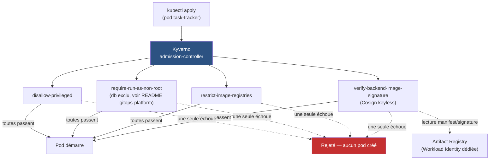
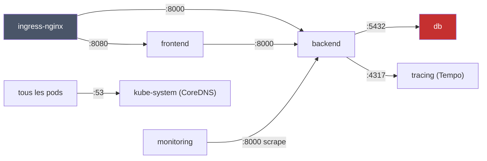

# DevSecOps & Supply Chain Security

Sécurise la chaîne d'approvisionnement logicielle de la plateforme des
Projets 1-3 : du code source jusqu'au déploiement Kubernetes. Construit
en suivant
[Projet-4-DevSecOps-Guide.md](Projet-4-DevSecOps-Guide.md).

## ⚠️ Ce dépôt ne contient PAS tout le Projet 4 — et c'est voulu

Contrairement aux Projets 2/3, les étapes 1 à 4 du guide (SAST, Trivy,
SBOM, Cosign) sont des étapes de **pipeline CI**, pas des ressources
Kubernetes — elles vivent dans `.github/workflows/` du dépôt
[gitops-platform](https://github.com/amadouldiallo/gitops-platform),
puisque c'est le pipeline CI de CETTE app qu'on sécurise. Un pipeline de
sécurité appartient au code qu'il protège, pas à un dépôt tiers.

Ce dépôt-ci contient les étapes 5 à 8 : ce qui s'applique au **cluster**
lui-même (Kyverno, Falco, NetworkPolicy durcies, tests de sécurité) —
déployées sur `gitops-platform`, le cluster GKE déjà provisionné (Projet
2), sans nouvelle infrastructure GCP.

| Étape | Où | Dépôt |
|---|---|---|
| 1 — SAST | `.github/workflows/` | gitops-platform |
| 2 — Trivy | `.github/workflows/` | gitops-platform |
| 3 — SBOM | `.github/workflows/` | gitops-platform |
| 4 — Cosign | `.github/workflows/` | gitops-platform |
| 5 — Kyverno | `k8s/kyverno/` | **ce dépôt** |
| 6 — Falco | `k8s/falco/` | **ce dépôt** |
| 7 — NetworkPolicy | `k8s/network-security/` | **ce dépôt** |
| 8 — Tests de sécurité | `docs/security-tests.md` | **ce dépôt** |

❓ **`terraform/` minimal ici, découvert en marche, pas planifié au départ** :
Kyverno, Falco et les NetworkPolicy sont des ressources Kubernetes pures —
mais Kyverno, lui, doit appeler directement l'API du registre pour
vérifier une signature Cosign, et n'hérite d'AUCUNE identité GCP par
défaut (contrairement à kubelet, qui tire les images via le SA du node).
Sans ça : `403 DENIED: artifactregistry.repositories.downloadArtifacts`
— vécu pour de vrai en testant l'Étape 5, voir
`terraform/modules/registry-access/`. La Workload Identity Federation de
la CI (pousser des images depuis GitHub Actions), elle, appartient
toujours au module `iam` **déjà existant** de gitops-platform, pas
dupliquée ici — seul le besoin RÉELLEMENT nouveau a sa place dans ce
dépôt.

## Comment lire ce dépôt

Mêmes symboles que les Projets 1-3 en tête de bloc de commentaire :

| Symbole | Signification |
|---|---|
| 🎯 | Le concept — ce que fait le composant, en langage simple |
| 🧠 | Analogie — pour ancrer le concept dans quelque chose de concret |
| ❓ | Pourquoi c'est important — la conséquence si on s'en passe |
| ⚠️ | Piège — une erreur facile à faire, rencontrée en écrivant ce code |
| 🔭 | Pour aller plus loin — une amélioration volontairement pas faite ici |

## Avancement

| Étape du guide | Statut |
|---|---|
| 1 — SAST | ✅ **testé sur le vrai pipeline** (dépôt gitops-platform) |
| 2 — Dependency Security (Trivy) | ✅ **3 vraies CVE trouvées et corrigées** (dépôt gitops-platform) |
| 3 — SBOM (Syft) | ✅ **SBOM réel généré (337 Ko), vérifié** (dépôt gitops-platform) |
| 4 — Image Signing (Cosign) | ✅ **signature vérifiée + contrôle négatif** (dépôt gitops-platform) |
| 5 — Admission Control (Kyverno) | ✅ **déployé, `Enforce`, testé sur le vrai cluster** — voir §Admission Control |
| 6 — Runtime Security (Falco) | ✅ **déployé, testé sur le vrai cluster** — voir §Runtime Security |
| 7 — Network Security | ✅ **deny-all + testé sur le vrai cluster** — voir §Network Security |
| 8 — Security Testing | ✅ **5 tests réels, 1 trou trouvé et corrigé** — voir §Security Testing |

## Étapes 1-4 — CI de sécurité (dépôt gitops-platform)

Voir [gitops-platform/.github/workflows/security-ci.yml](https://github.com/amadouldiallo/gitops-platform/blob/main/.github/workflows/security-ci.yml)
et sa section [🔒 Évolutions liées au Projet 4](https://github.com/amadouldiallo/gitops-platform#-évolutions-liées-au-projet-4)
pour le détail complet. Résumé de ce qui a été RÉELLEMENT trouvé et
vérifié, pas juste "la CI est verte" :

- **SAST (Bandit)** : 0 issue sur le code du backend, vérifié localement
  puis en CI.
- **Trivy** a trouvé **3 vraies CVE HIGH** (`starlette==0.41.3`, avec
  correctif disponible pour chacune) — bloquées par le pipeline comme
  prévu, corrigées, re-vérifiées à 0 CVE restante.
- **SBOM** (Syft, SPDX) : 337 Ko générés par build, publiés comme
  artefact du run.
- **Cosign** (keyless, OIDC GitHub Actions) : signature vérifiée après
  coup depuis un poste externe, avec l'identité EXACTE attendue
  (dépôt + workflow + branche) — et un contrôle négatif confirmant
  qu'une identité incorrecte est bien rejetée, pas juste que la bonne
  passe.

⚠️ **Piège d'outillage rencontré en testant en local** : cette machine
tourne macOS 12, plus supporté par Homebrew — installer `cosign`
localement déclenchait une compilation depuis les sources (Go) qui a
rempli le disque (`no space left on device`). Contourné en téléchargeant
directement les binaires statiques précompilés depuis les releases
GitHub de chaque outil (`trivy`, `cosign`) — aucune compilation, aucun
Homebrew, quelques dizaines de Mo chacun.

## Admission Control (Kyverno)

`k8s/kyverno/` installe Kyverno (admission + background controller
seulement — cleanup/reports désactivés, inutiles ici, voir
`values.yaml`) et 4 `ClusterPolicy`, **scopées au namespace
`task-tracker`** — les appliquer à tout le cluster aurait cassé
Prometheus, Grafana, Loki, Tempo, Argo CD, cert-manager, Vault,
ingress-nginx et OpenCost d'un coup (aucun ne vient du registre approuvé
ni n'est signé par notre CI).



| Politique | Portée | Résultat sur l'app réelle |
|---|---|---|
| `disallow-privileged-containers` | tout `task-tracker` | ✅ passe (frontend/backend/db) |
| `require-run-as-non-root` | tout `task-tracker` SAUF `db` | ✅ passe (db exclu, exception documentée) |
| `restrict-image-registries` | tout `task-tracker` | ✅ passe (toutes les images viennent déjà du registre approuvé) |
| `verify-backend-image-signature` | uniquement `task-tracker-backend` | ✅ passe, après correction de 2 bugs réels (voir plus bas) |
| `disallow-host-path` | tout `task-tracker` | ➕ **ajoutée à l'Étape 8** — trou de couverture trouvé en testant, voir [docs/security-tests.md](docs/security-tests.md) |

**Déployées d'abord en `Audit`**, vérifiées contre l'app RÉELLEMENT en
place, puis basculées en `Enforce` seulement une fois confirmé qu'aucune
ne casserait quoi que ce soit — pas l'inverse.

**3 vrais bugs trouvés en testant, pas supposés :**

1. **Kyverno n'avait aucun accès au registre** pour vérifier une
   signature : `403 DENIED: artifactregistry.repositories.downloadArtifacts`.
   Un pod ordinaire n'hérite PAS de l'identité GCP du node (celle-ci ne
   sert qu'à kubelet, en interne, pour les pulls d'image) — fixé avec une
   Workload Identity dédiée (`terraform/modules/registry-access/`,
   découverte et ajoutée en cours de route, voir plus haut).
2. **La signature ne couvrait pas l'image réellement déployée** :
   la CI (Étape 4) signait le tag SHA, mais le chart Helm déploie
   `:latest` — deux tags différents, `:latest` jamais passée par le
   pipeline sécurisé. Kyverno vérifiait donc le mauvais objet
   ("no signatures found"). Fixé côté gitops-platform : la CI pousse et
   signe maintenant les deux tags pour le même digest.
3. **`Enforce` + `mutateDigest: false` bloquait le déploiement en boucle**
   ("missing digest"), alors que le Pod réel passait la vérification sans
   problème — l'autogen de la politique au niveau `Deployment` attend un
   digest que seule la création d'un vrai Pod obtient (mutation). Fixé en
   désactivant l'autogen pour cette politique précise
   (`pod-policies.kyverno.io/autogen-controllers: "none"`) : elle ne
   s'applique plus qu'à la création réelle du Pod.

**Vérifié réellement, pas juste "Ready: True"** : le pod backend tourne
maintenant avec son image épinglée par digest exact
(`task-tracker-backend:latest@sha256:206c97...`), preuve que Kyverno a
vraiment vérifié ET muté la ressource — et l'app reste joignable
(`200`) après un rollout complet (frontend + backend + db) avec les 4
politiques actives en `Enforce`.

```bash
helm install kyverno kyverno/kyverno -n kyverno --create-namespace \
  -f k8s/kyverno/values.yaml --version 3.9.1 --wait

kubectl apply -f k8s/kyverno/policies.yaml
```

## Runtime Security (Falco)

`k8s/falco/` — Falco en DaemonSet (mode `modern_ebpf` +
`leastPrivileged: true` : capabilities Linux précises plutôt que
`privileged: true`, cohérent avec l'esprit du projet), règle par défaut
"Terminal shell in container" déjà présente, complétée par une règle
personnalisée scopée à `task-tracker`.

⚠️ **Couverture partielle assumée** : sur 5 nodes, 1 reste sans Falco —
le cluster est réellement à court de CPU (98% utilisé cluster-wide, plus
de la moitié consommée par les DaemonSets SYSTÈME de GKE eux-mêmes :
anetd/Cilium, fluentbit, gke-metadata-server). Décision prise
consciemment plutôt que d'augmenter `machine_type` (un vrai coût GCP
récurrent) : Falco tourne là où il y a de la place, le node saturé reste
sans détection runtime — documenté ici, pas caché.

**3 vrais bugs trouvés en testant, pas supposés :**

1. **`maxUnavailable` implicite (1) a fait stagner tout le rollout** :
   le pod jamais schedulable sur le node saturé comptait comme "en
   cours de mise à jour" et bloquait la mise à jour des 4 autres nodes,
   pourtant sains. Fixé avec `maxUnavailable: 100%`.
2. **La règle personnalisée ne se déclenchait JAMAIS**, quelle que soit
   sa condition — y compris une copie EXACTE de la condition de la
   règle par défaut, qui elle fonctionne. Fausse piste explorée en
   premier (et écartée à tort trop tard) : soupçonner le filtrage par
   `k8s.ns.name`/`container.name`/`container.image.repository`.
   **Vraie cause** : `rule_matching: first` (réglage par défaut du
   moteur Falco) — il arrête d'évaluer les règles pour un événement dès
   qu'UNE règle a matché, et la règle par défaut (chargée avant tout
   fichier personnalisé) consommait systématiquement chaque événement
   de shell en premier. Rien à voir avec les noms de champs. Fixé avec
   `falco.rule_matching: all`.
3. Consequence du bug précédent : plusieurs itérations de diagnostic
   ont été nécessaires avant de trouver la vraie cause — documenté tel
   quel (fausse piste comprise) plutôt que réécrit comme si la bonne
   réponse avait été trouvée du premier coup.

**Vérifié réellement** : un `kubectl exec` réel dans le pod backend
déclenche SIMULTANÉMENT la règle par défaut (`Notice`, générique) ET la
règle personnalisée (`Critical`, scopée `task-tracker`, avec le nom du
pod/conteneur/commande exacts) — même timestamp, deux règles
indépendantes sur le même événement, preuve que `rule_matching: all`
fonctionne pour de vrai.

```bash
helm install falco falcosecurity/falco -n falco --create-namespace \
  -f k8s/falco/values.yaml --version 9.1.0 --wait
```

## Network Security

`k8s/network-security/policies.yaml` — deny-all ingress ET egress par
défaut sur le namespace `task-tracker`, puis autorisation explicite de
chaque flux réellement nécessaire.



❓ **Pourquoi ce fichier ne modifie AUCUNE ressource des Projets 2/3** :
les `NetworkPolicy` Kubernetes sont additives — une nouvelle policy en
`policyTypes: ["Egress"]` s'AJOUTE aux policies existantes (en
`["Ingress"]` seulement) sans les remplacer. Contrairement aux Étapes
précédentes de ce projet (qui avaient dû éditer gitops-platform ou
observability-platform), le durcissement réseau tient entièrement dans
ce dépôt.

⚠️ **Le piège classique, anticipé cette fois** : un deny-all egress sans
règle DNS explicite casse tout — même résoudre un Service par son nom
dépend d'un accès réseau réel à CoreDNS. `allow-dns-egress` est
appliquée AVANT les deny-all dans ce fichier (l'ordre d'un YAML
multi-documents avec `kubectl apply -f` est respecté), pour réduire au
minimum la fenêtre où le namespace serait bloqué sans la moindre
autorisation.

**Vérifié réellement, pas juste "les policies existent" :**
- App publique (frontend + `/api` direct) : `200` après application des
  8 policies, écriture réelle en base confirmée (`POST /api/tasks` →
  `201`).
- Prometheus continue de scraper le backend (`up{job="task-tracker-backend"}
  == 1`), les traces continuent d'arriver dans Tempo — aucune régression
  sur les Projets 2/3.
- `db` reste sain sans AUCUNE règle egress dédiée au-delà du DNS partagé
  — confirmé qu'une base de données n'a réellement besoin d'aucune
  connexion sortante.
- **Contrôle négatif** : une connexion TCP directe depuis le pod backend
  vers `grafana.grafana.svc.cluster.local` (un service qui n'a jamais été
  autorisé) `timeout` — le deny-all bloque réellement ce qu'il est censé
  bloquer, pas seulement ce qu'on a pensé à tester.

```bash
kubectl apply -f k8s/network-security/policies.yaml
```

---

## Security Testing (chaos volontaire)

[docs/security-tests.md](docs/security-tests.md) — 5 manifestes
délibérément non conformes (`k8s/security-tests/`), chacun isolant une
seule violation, déployés pour de vrai contre les politiques Kyverno en
`Enforce`.

| Test | Résultat |
|---|---|
| Conteneur `privileged: true` | ✅ Bloqué (par 2 politiques indépendantes) |
| Volume `hostPath` (`/` du node) | ⚠️ **Admis au premier essai** — accès réel confirmé (`cat /host/etc/passwd`), politique manquante ajoutée en direct, re-testé bloqué |
| Conteneur sans `runAsNonRoot` | ✅ Bloqué |
| Image jamais signée (même registre, tag non passé par la CI) | ✅ Bloqué |
| Image d'un registre public (Docker Hub) | ✅ Bloqué |

❓ **Le résultat le plus important n'est pas "4 sur 5 bloqués"** — c'est
que le 5ᵉ, sur son PREMIER essai, ne l'était pas. Un `hostPath` monté sur
`/` du node a été accepté par Kyverno (aucune des 4 politiques de
l'Étape 5 ne couvre ce vecteur), et un `kubectl exec` a confirmé un vrai
accès en lecture au `/etc/passwd` du node — pas une faille théorique.
Corrigé en ajoutant une 5ᵉ `ClusterPolicy`
(`disallow-host-path`), puis re-testé avec le MÊME manifeste : bloqué.
Le nombre réel de politiques actives sur ce cluster est passé de 4 à 5
en conséquence directe de ce test — exactement ce que le guide anticipe
("une politique qui ne bloque pas ce qu'elle est censée bloquer est un
faux sentiment de sécurité pire que l'absence de politique").

Tous les pods de test et l'image non signée ont été supprimés après
vérification.

```bash
kubectl apply -f k8s/security-tests/01-privileged.yaml       # bloqué
kubectl apply -f k8s/security-tests/02-hostpath.yaml          # bloqué (après correction)
kubectl apply -f k8s/security-tests/03-root-container.yaml    # bloqué
kubectl apply -f k8s/security-tests/04-unsigned-image.yaml    # bloqué
kubectl apply -f k8s/security-tests/05-unapproved-registry.yaml  # bloqué
```

---

## Guide terminé — et maintenant ?

Les 8 étapes du Projet 4 sont construites et testées sur le vrai
`gitops-platform` (Projet 2) et son pipeline CI, pas seulement décrites.
Récapitulatif des découvertes réelles qui ne figuraient dans aucun plan
initial :

- Un pipeline CI qui n'existait pas encore pour ce dépôt (tous les
  builds précédents avaient été faits à la main) — mis en place avec
  Workload Identity dédié, sans clé statique.
- 3 vraies CVE HIGH trouvées par Trivy dans une dépendance figée depuis
  le Projet 3, corrigées, avec un bonus inattendu (déblocage d'une
  contrainte de version posée pour une tout autre raison).
- Kyverno sans accès au registre pour vérifier une signature — un pod
  ordinaire n'hérite pas de l'identité GCP du node.
- Une CI qui signait un tag différent de celui réellement déployé — la
  signature vérifiait le mauvais objet, sans que rien ne le signale
  avant un test réel.
- Un bug retors de Falco (`rule_matching: first`) qui a fait chercher la
  cause au mauvais endroit avant de la trouver au bon.
- Un `hostPath` accepté par erreur, avec un accès réel démontré avant
  d'être corrigé.

Comme le suggère le guide original : le **Projet 5 bonus (Platform
Engineering / Backstage)** reste une option à part, pas une suite
obligatoire — les 4 projets du socle (Cloud/IaC, Kubernetes/GitOps,
Observability/SRE, DevSecOps) sont maintenant complets.
